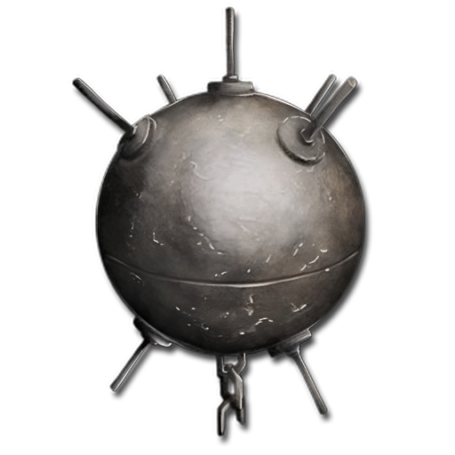

<h1 align="center">Cryptos MCLauncher</h1>

Custom launcher for modded minecraft for my Server written in Electron.

This launcher is based on [ReactMCLauncher][ReactMCLauncher] and uses [MCLC][mclc]

## Features

- 📂 Minecraft is automatically downloaded. Files are validated before launch. Corrupt or incorrect files will be redownloaded.
- ☕ Java is automatically downloaded and installed if java is not installed.
- Automatic updates. That's right, the launcher updates itself.
- And more...

## Links
[nodejs]: https://nodejs.org/en/ "Node.js"
[ReactMCLauncher]: https://github.com/dd060606/ReactMCLauncher "ReactMCLauncher"
[mclc]: https://github.com/Pierce01/MinecraftLauncher-core "MCLC"